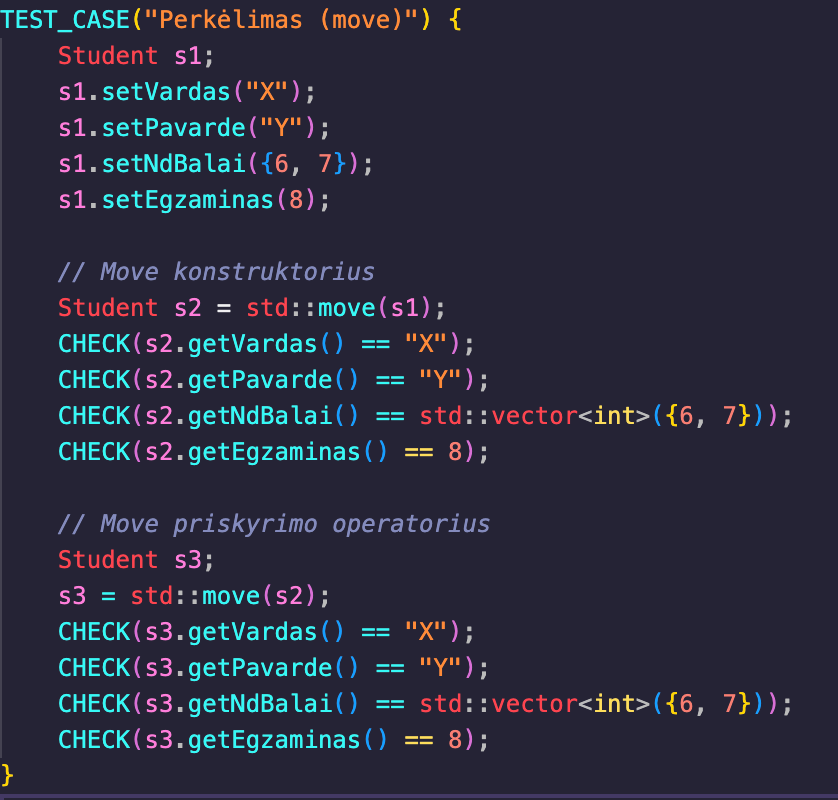

# OOP

## Perdengtų metodų aprašymas

Šiame projekte naudojami perdengti metodai, kurie leidžia patogiai dirbti su studentų duomenimis.

### Duomenų įvestis

1. **Rankinė įvestis**:
   - Naudojamas perdengtas `operator>>` metodas, kuris leidžia patogiai įvesti studento duomenis iš standartinio įvesties srauto.
   - Įvedimo metu tikrinama, ar vardas ir pavardė sudaryti tik iš raidžių, o pažymiai ir egzamino rezultatas yra tinkamo intervalo (0–10).
   - Pavyzdys:
     ```
     Įveskite studento vardą: Jonas
     Įveskite studento pavardę: Jonaitis
     Įveskite namų darbų pažymius (baigti - ne skaičius): 8 9 10
     Įveskite egzamino pažymį: 9
     ```

2. **Automatinė įvestis**:
   - Naudojama funkcija `generuotiStudentus`, kuri automatiškai sugeneruoja nurodytą kiekį studentų su atsitiktiniais vardais, pavardėmis, pažymiais ir egzamino rezultatais.
   - Pavyzdys:
     ```cpp
     std::vector<Student> studentai = generuotiStudentus(100);
     ```

3. **Įvestis iš failo**:
   - Naudojama funkcija `nuskaitytiStudentus`, kuri skaito studentų duomenis iš failo. Failo formatas turi atitikti numatytą struktūrą (vardas, pavardė, pažymiai, egzaminas).
   - Pavyzdys:
     ```
     Jonas Jonaitis 8 9 10 9
     Petras Petraitis 7 8 6 8
     ```
### Papildoma informacija

- **Destruktorius**:
  - `Student::~Student` užtikrina, kad visi dinaminiai resursai (pvz., `nd_balai`) būtų tinkamai atlaisvinti.
- **Konstruktoriai ir operatoriai**:
  - Implementuota „penkių taisyklė“ (`Rule of Five`), įskaitant kopijavimo ir perkėlimo konstruktorius bei priskyrimo operatorius.


### *The Rule of five* Testai

| Testo nuotrauka | Aprašymas |
|-----------------|-----------|
|  | **Kopijavimo testai**: tikrina kopijavimo konstruktorių ir priskyrimo operatorių, kurie sukuria tikslias objektų kopijas išsaugant visus duomenis |  
|  | **Perkėlimo testai**: tikrina move konstruktorių ir priskyrimo operatorių, kurie efektyviai perkelia resursus iš vieno objekto į kitą |

## Visų testų rezultatai


## Executable su O1 failo dydis `221KB`
## Executable su O2 failo dydis `205KB`
## Executable su O3 failo dydis `238KB`

## FAILŲ TYRIMŲ REZULTATAI SU 03 vėliavėlę:


|        FAILAS          |       VECTOR(STRUCT) #3ST       |
|------------------------|---------------------------------|
| Gstudentai100000.txt   |            0.197912             |   
| Gstudentai1000000.txt  |            1.80717              |   


|        FAILAS          |       VECTOR(CLASS) #3ST        |
|------------------------|---------------------------------|
| Gstudentai100000.txt   |            0.132619             |   
| Gstudentai1000000.txt  |            1.28624              | 


## FAILŲ TYRIMŲ REZULTATAI SU 02 vėliavėlę:


|        FAILAS          |       VECTOR(STRUCT) #3ST       |
|------------------------|---------------------------------|
| Gstudentai100000.txt   |           0.193232              |   
| Gstudentai1000000.txt  |           1.71543               |   


|        FAILAS          |       VECTOR(CLASS) #3ST        |
|------------------------|---------------------------------|
| Gstudentai100000.txt   |           0.138643              |   
| Gstudentai1000000.txt  |           2.40901               | 


## FAILŲ TYRIMŲ REZULTATAI SU 01 vėliavėlę:


|        FAILAS          |       VECTOR(STRUCT) #3ST       |
|------------------------|---------------------------------|
| Gstudentai100000.txt   |            0.194721             |   
| Gstudentai1000000.txt  |            1.68131              |   


|        FAILAS          |       VECTOR(CLASS) #3ST        |
|------------------------|---------------------------------|
| Gstudentai100000.txt   |           0.133387              |   
| Gstudentai1000000.txt  |           1.28121               | 


## Testavimo aplinka

- **Procesorius**: Apple M3
- **RAM**: 8GB
- **SSD**: 256GB

## Naudojimosi instrukcija

1. **Failų generavimas**:
   - Paleiskite programą ir pasirinkite failų generavimo funkciją.
   - Po failų generavimo reikės pasirinkti testai su failais.

2. **Failų darbai**:
   - Pasirinkite norimą failą iš pateikto sąrašo.
   - Pasirinkite norimą rušiavimą
   - Pasirinkite  norimą skirstymo strategiją:
   - Programa išrūšiuos studentus į „vargšiukus“ ir „kietiakus“ bei išsaugos juos atskiruose failuose.

3. **Rezultatų analizė**:
   - Peržiūrėkite sugeneruotus failus ir programos išvestį, kurioje pateikiamas veikimo laikas.

## Įdiegimo instrukcija

1. **Reikalavimai**:
   - GCC arba kitas C++ kompiliatorius su `C++17` ar naujesne versija.
   - `make` įrankis (Unix sistemose įdiegtas pagal nutylėjimą).

2. **Įdiegimas**:
   - Atsisiųskite projektą:
     git clone <https://github.com/frogg-kek/OOP-2>

   - Paleiskite `make` komandą

   - Sukurtas vykdomasis failas bus pavadintas `kursiokai`.

3. **Paleidimas**:
   - Paleiskite programą:
     `./kursiokai`

4. **Valymas**:
     `make clean`
````
